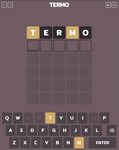

# Os melhores (ou o piores) chutes para o Termo!

### Descubra quais são as melhores palavras para começar o jogo termo!

Esse repositório guarda os scripts (Python) utilizados para determinar quais os melhores chutes possíveis para acertar a palavra do dia em jogos tipo Termo. Através de análise estatística, foi possível estimar quais as melhores palavras para serem utilizadas considerando duas condições:

1. Uma única palavra (sem repetição de letras)
2. Duas palavras (sem repetição de letras)
3. Três palavras (sem repetição de letras)   ---> Análise não finalizada

## Resultados

### Para o PRIMEIRO chute

#### Top 10 MELHORES palavras para o primeiro chute

| Palavra | "Força" |
| :-: | :-: 
| serao | 0.084141 |
| terao | 0.081602 |
| lerao | 0.080955 |
| verao | 0.080237 |
| meiao | 0.079954 |
| coras | 0.078370 |
| senao | 0.077442 |
| ceras | 0.077387 |
| moras | 0.077378 |
| roias | 0.077286 |

#### Top 10 PIORES palavras para o primeiro chute

| Palavra | "Força" |
| :-: | :-: |
| induz | 0.004521 |
| esqui | 0.011991 |
| enchi | 0.013309 |
| fuzil | 0.013497 |
| ungir | 0.013529 |
| ilhou | 0.014051 |
| infle | 0.014239 |
| zumbi | 0.014274 |
| chovi | 0.014548 |
| enfim | 0.015369 |

### Para os DOIS PRIMEIROS chutes

#### Top 10 MELHORES pares de palavras para os dois primeiros chutes

| Palavra 1 | Palavra 2 | "Força" |
| :-: | :-: | :-: |
| cures	| pilao | 0.115462 |
| ceras | muito | 0.115441 |
| curto | meias | 0.115441 |
| cures | timao | 0.115334 |
| cinto | meras | 0.115303 |
| certo | minas | 0.115303 |
| ceras | minto | 0.115303 |
| cento | miras | 0.115303 |
| cumes | pirao	| 0.114833 |
| cures | filao	| 0.114816 |

#### Top 10 PIORES pares de palavras para os dois primeiros chutes

| Palavra 1 | Palavra 2 | "Força" |
| :-: | :-: | :-: |
| escol	| induz	| 0.020614	|
| glose	| induz	| 0.022064 |
| expor	| induz	| 0.022287 |
| chove	| induz	| 0.022990 |
| induz	| plote	| 0.024236 |
| induz	| obste	| 0.025825 |
| chore	| induz	| 0.026971 |
| induz	| prove	| 0.027244 |
| induz	| prole | 0.027471 |
| induz	| olhem	| 0.027852 |

## Análise dos dados

Todos os detalhes relacionados análise estatística, códigos e premissas adotadas para encontrar as melhores palavras estão descritas [neste notebook](https://github.com/andersonmdcanteli/termo/blob/main/termo_analysis.ipynb), que também esta disponível via [google drive](https://colab.research.google.com/drive/1vmq6Hq2CaDEudNHVUDNd9e6bS1fikJqj?usp=sharing).

## Dashboard

Foi desenvolvido um dashboard para encontrar a força de uma palavra específica! O código esta disponível na sub-pasta **[dashboard](https://github.com/andersonmdcanteli/termo/tree/main/dashboard)**. É possível alterar a forma de cálculo e a quantidade de palavras. A Figura abaixo é um print da versão final.

## Dataset

O conjunto de dados utilizado para realizar os testes foi obtido no site do [IME](https://www.ime.usp.br/~pf/dicios/index.html), no dia 22/07/2022, e conta com um pouco mais do que 245 mil palavras em português (brasileiro).

## Licença

